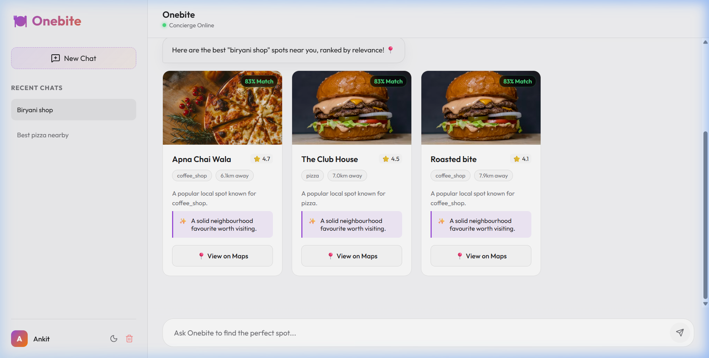

# 🍽️ Onebite — AI Culinary Concierge

Onebite is a premium, AI-powered restaurant discovery and culinary assistant. Built with modern web technologies, it provides a sophisticated interface for finding the perfect dining spots, exploring cuisines, and getting personalized recommendations.



## ✨ Features

- **🧠 Multi-Model AI Waterfall**: Leverages a robust fallback system (Groq → NVIDIA → Gemini) to ensure lightning-fast and intelligent conversational responses.
- **📍 Real-time Location Intelligence**: Automatically detects your location (with permission) to find the best restaurants nearby using the Overpass API (OpenStreetMap).
- **🌓 Adaptive Theme**: Seamlessly switch between a sleek **Dark Mode** and a clean **Light Mode**. Your preference is saved across sessions.
- **💾 Persistent Sessions**: Never lose a recommendation. All chat histories are stored locally and synced across your visits.
- **⚡ Performance Optimized**: Smart food query detection bypasses AI when possible to provide instant, zero-latency results for direct restaurant searches.
- **🎨 Premium UI/UX**: Designed with a focus on rich aesthetics, featuring glassmorphism, fluid animations, and a responsive layout that works beautifully on desktop and mobile.

## 🛠️ Tech Stack

- **Frontend**: React 19 + Vite
- **Styling**: Vanilla CSS with custom design tokens and CSS variables
- **Icons**: Lucide React
- **AI Integration**: 
  - [Groq SDK](https://groq.com/) (Primary)
  - [NVIDIA NIM API](https://www.nvidia.com/en-us/ai-data-science/generative-ai/nim/) (Secondary)
  - [Google Generative AI](https://aistudio.google.com/) (Fallback)
- **Data Source**: OpenStreetMap (Overpass API)

## 🚀 Getting Started

### Prerequisites

- Node.js (v18 or higher)
- npm or yarn

### Installation

1. Clone the repository:
   ```bash
   git clone https://github.com/CodeDevAlchemy/Ai-Bot.git
   cd restaurant-bot
   ```

2. Install dependencies:
   ```bash
   npm install
   ```

3. Create a `.env` file in the root directory and add your API keys:
   ```env
   VITE_GROQ_API_KEY=your_groq_key
   VITE_GEMINI_API_KEY=your_gemini_key
   VITE_NVIDIA_API_KEY=your_nvidia_key
   ```
   > [!IMPORTANT]
   > Your API keys are kept secure. The `.env` file is included in `.gitignore` and will not be uploaded to GitHub.

4. Start the development server:
   ```bash
   npm run dev
   ```

5. Open your browser and navigate to `http://localhost:5173/`.

## 📜 License

Distributed under the MIT License. See `LICENSE` for more information.

---

Built with ❤️ by [CodeDevAlchemy](https://github.com/CodeDevAlchemy)
